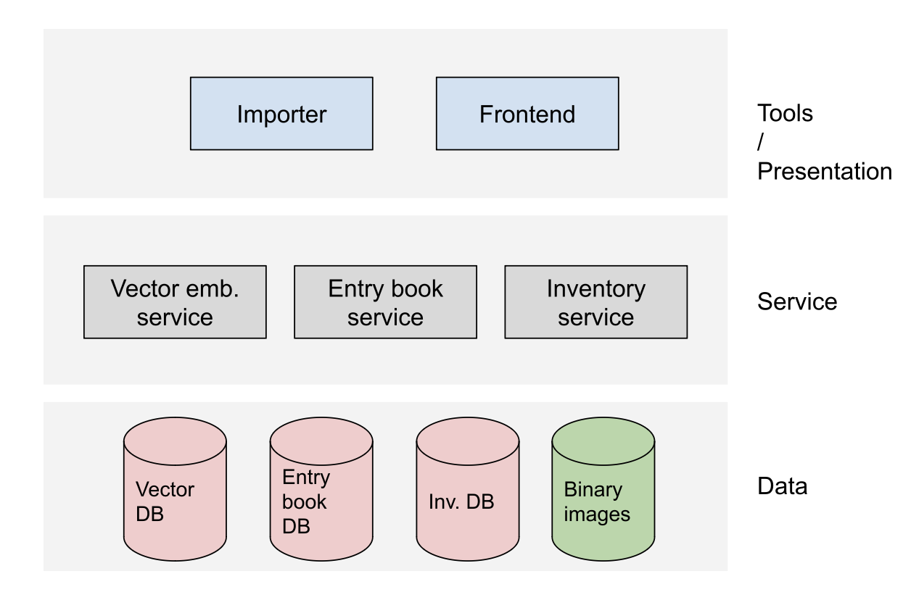

# Implementation idea

A museum usually has already existing objects that are not yet in the inventory. Those objects already entered the museum ages ago, and they would typically not be gathered via the museum's entry book. Instead, the object is added directly to the inventory of the collection. Because the integration with the existing inventory software of the museum is out of the scope of this project, I would propose that we do the following:

1. Develop one web app with three masks: Entry book, inventory artifact details, and inventory search.
2. The museum entry book mask does the first basic information gathering and photo upload. We could replace this part easily with a mobile application, too.
3. We can then take a new entry over into the inventory by assigning an inventory id. When the artifact is saved with an inventory number, we mark it as 'entered' in the entry book.
4. The artifact record within the inventory will then show similar objects and recommend the properties. 
5. Furthermore, the inventory page (artifact details page) will allow us to override any recommendations. As soon as we save the artifact record, we mark it as 'curated' within the inventory.
6. We will also implement a search mask to find artifacts based on full-text search and other properties (e.g., the inventory id). As soon as you click on an artifact in the search result, you get back into the artifact details mask that shows similar artifacts within the database again. It also allows you to modify properties.

